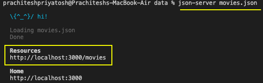
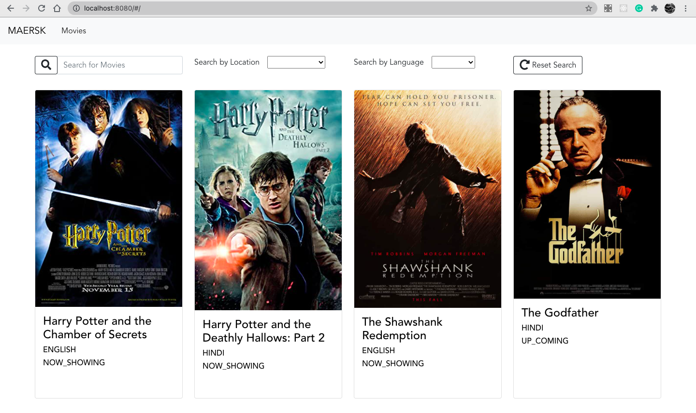
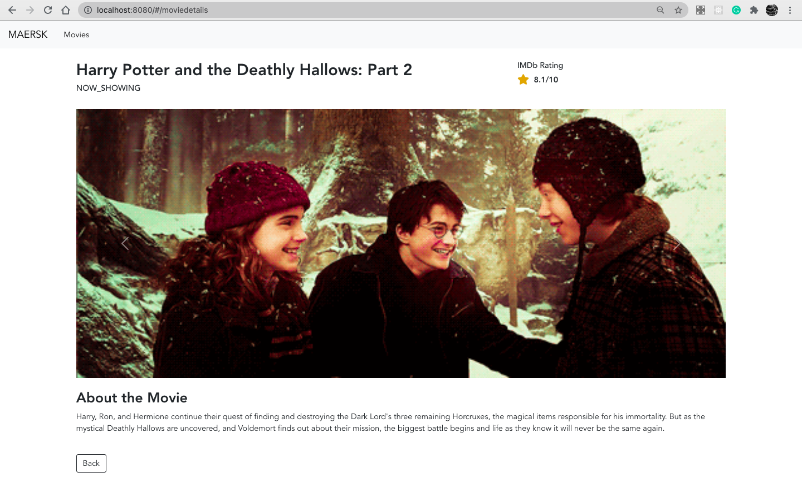

# maersk_movies

## Project setup
```
npm install
```

### Install json-server and run the fake API locally
```
1. npm install json-server -g
2. cd src/data
3. json-server movies.json
```

### Compiles and hot-reloads for development
```
1. Open a new terminal/ check if you are in main path
2. npm run serve
```
### Screenshots for reference
- Movie Search Page



- Movie Details Page


